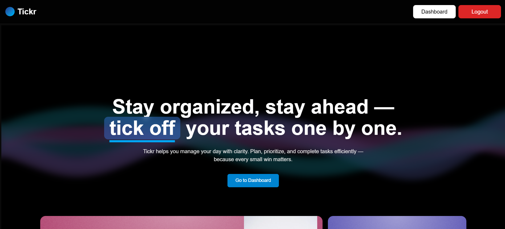

# Tickr 🧠✅  
A full-stack productivity web application for task planning and tracking.

Tickr helps users organize their day by creating, updating, and managing tasks with an intuitive and responsive UI. Built with **Next.js**, **Tailwind CSS**, **TypeScript**, and a **Node.js + Express + Prisma** backend, Tickr supports authentication, status management, and persistent data storage with PostgreSQL.

---

## ✨ Features

- 🔐 **Authentication** (JWT-based)
- ✅ **Task CRUD Operations**
  - Create, read, update, delete tasks
  - Persisted status: Pending, In Progress, Completed
- 🎨 **Animated UI**
  - Expandable card modal to show task details and controls
  - Tailwind + Framer Motion for modern UX
- 📦 Proper file structure for frontend and backend separation

---
## 🖼️ Screenshot




## 🏗️ Tech Stack

| Layer       | Tech                                             |
|-------------|--------------------------------------------------|
| Frontend    | Next.js 14, React, Tailwind CSS, TypeScript      |
| Animations  | Framer Motion                                    |
| Auth        | JWT (stored in `localStorage`)                   |
| Backend     | Express.js, Prisma ORM, TypeScript               |
| Database    | PostgreSQL (via Prisma)                          |
| Hosting     | Vercel(frontend), Render(backend), Supabase(db)  |

---

## 📁 Project Structure

```

Tickr/
├── frontend/          # Next.js app (client)
│   ├── app/
│   ├── components/
│   ├── hooks/
│   ├── styles/
│   └── public/
├── backend/           # Express API (server)
│   ├── routes/
│   ├── middlewares/
│   ├── prisma/
│   └── index.ts
└── README.md

````

---

## 🚀 Setup Instructions

### 🔧 Prerequisites

- Node.js >= 18
- PostgreSQL DB
- Git

---

### 1. Clone the Repository

```bash
git clone https://github.com/your-username/tickr.git
cd tickr
````

---

### 2. Setup the Backend

```bash
cd backend
npm install
```

* Configure your environment:

  ```env
  DATABASE_URL="postgresql://<user>:<password>@localhost:5432/tickr"
  JWT_SECRET="your_jwt_secret"
  ```
* Run migrations:

  ```bash
  npx prisma migrate dev --name init
  ```
* Start the server:

  ```bash
  npm run dev
  ```

---

### 3. Setup the Frontend

```bash
cd ../frontend
npm install
npm run dev
```

> The frontend runs on `http://localhost:3000`, backend on `http://localhost:5000`

---

## ✅ API Endpoints

| Method | Endpoint             | Description                |
| ------ | -------------------- | -------------------------- |
| POST   | `/api/auth/register` | Register a new user        |
| POST   | `/api/auth/login`    | Login and get token        |
| GET    | `/api/tasks`         | Fetch user's tasks         |
| POST   | `/api/tasks`         | Create a new task          |
| PUT    | `/api/tasks/:id`     | Update task (status, etc.) |
| DELETE | `/api/tasks/:id`     | Delete a task              |

---

## 🔒 Authentication Flow

* JWT token stored in `localStorage`
* Protected routes redirect unauthenticated users to `/login`
* Token is decoded in the dashboard to show user info and fetch tasks

---

## 💄 UI Enhancements

* Modals with animations using `framer-motion`
* Status dropdowns that persist to the backend
* Edit/Delete task from modal
* Dark mode and mobile responsiveness
* Clean layout with reusable components

---

## 🧪 Known Issues / To-Do

* [ ] Improve validation feedback
* [ ] Pagination for tasks
* [ ] Task reminders via email/notifications

---

## 👩‍💻 Author

**Shreya Srivastava**
[GitHub](https://github.com/Shreya904)
[LinkedIn](https://www.linkedin.com/in/shreya-srivastava-2b11b225b/)

---

